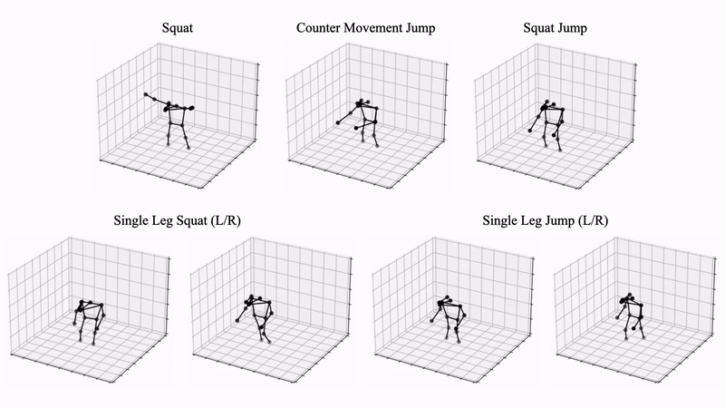

# ForcePose

This repo contains code and data for [*Learning to Estimate External Forces of Human Motion in Video, ACMMM 2022*](https://arxiv.org/pdf/2207.05845.pdf).

## Update
* (10/08/2023) Released [ForcePosev1.1](https://prism.eecs.umich.edu/natlouis/forcepose/forcepose_1.1.tar.gz)
  	- Include toe and heel keypoint detections using [AlphaPose](https://github.com/MVIG-SJTU/AlphaPose/tree/master) (Coco Wholebody+256x192+ResNet50)
  	- Include center-of-pressure (cop) data points
  	- Fix misalignment between RGB videos and force plate (and mocap data)

## Data
**Download data** [here (ForcePosev1.0)](https://prism.eecs.umich.edu/natlouis/forcepose/forcepose.tar.gz)

ForcePose contains motion capture markers, coco detections, and force plate magnitudes for the following movements (triangulated COCO detections shown):



The ForcePose dataset contains 168 movements and 8 subjects (6 train, 2 validation).

124 trials/movements in train
44 trials/movements in validation

Each sample contains multiple camera views (up to 8), 2D pose predictions on each view,
triangulated poses for each time step, and corresponding Ground Reaction Forces (GRFs).
The RGB data is recorded 50 fps, the motion capture at 100 fps, and the force plates at 600 fps.

Data format (list):
Each video/trial is a dict with the following keys:

```
- "subject" (string)
- "movement" (string)
- "frame_width" (int)
- "frame_height" (int)
- "total_frames" (int)
- "frames" (list)
        - "image_name" (string)
        - "image_index" (int)
        - "cam"_[x] (dict)
                - 'box' (bounding box - xtl,ytl,xbr,ybr)
                - 'keypoints' - 51 2D joints (17 joints x 3 [x,y,confidence]) (MSCOCO format)
        - "triangulated_pose" (list)
                - 17 triangulated joints (MSCOCO format)
- "mocap" (dict)
        - [marker_name] (list)
                - N frames, marker position  
- "grf" (dict) 
        - 'time' (list)
        - 'ground_force1_vx' (list)
        - 'ground_force1_vy' (list)
        - 'ground_force1_vz' (list)
        - 'ground_force2_vx' (list)
        - 'ground_force2_vy' (list)
        - 'ground_force2_vz' (list)
- "cop" (dict)
        - 'time' (list)
        - 'ground_force1_px' (list)
        - 'ground_force1_py' (list)
        - 'ground_force1_pz' (list)
        - 'ground_force2_px' (list)
        - 'ground_force2_py' (list)
        - 'ground_force2_pz' (list)
```
## Code

### System Requirements:
- Linux (Tested on Ubuntu 20.04)
- CUDA 11.x
- Python 3.8+
- PyTorch 1.7.1+

### Creating a Conda Virtual Environment:

```bash
conda env create -f environment.yml
conda activate forcepose
```

### Preparing data:
```bash
mv forcepose.tar.gz data/
cd data
tar -xvf forcepose.tar.gz
cd ..
python3 data/prepare_data_force_pose.py
```

This will create three files:
- data/data_2d_force_pose_pt_coco.npz
- data/data_3d_force_pose.npz
- data/data_2d_force_pose_gt.npz

### Testing:
In our experiments, we optimize each modality for the lowest RMSE. Hence, the number of frames for pre-trained models will vary.

**Download saved weights**: [mocap](https://prism.eecs.umich.edu/natlouis/forcepose/mocap.tar.gz), [coco_3d](https://prism.eecs.umich.edu/natlouis/forcepose/coco_3d.tar.gz), [coco_2d](https://prism.eecs.umich.edu/natlouis/forcepose/coco_2d.tar.gz)
and extract inside of `checkpoints` directory.

| frames | num_force_thresh| input_type | data_path | checkpoint_name | 
|--|--|--|--|--|
|27|1|mocap|checkpoint/mocap|mocap_27frames.bin|
|27|2|mocap|checkpoint/mocap|mocap_27frames_t2.bin|
|43|1|3d|checkpoint/coco_3d|3d_43frames.bin|
|43|2|3d|checkpoint/coco_3d|3d_43frames_t2.bin|
|81|1|2d|checkpoint/coco_2d|2d_81frames.bin|
|81|2|2d|checkpoint/coco_2d|2d_81frames_t2.bin|

**Format:**
```
python3 run_poseformer_force.py \ 
	-k pt_coco \
	-b 512 \
	-f $frames \
	--checkpoint $data_path \
	--num_force_thresh $num_force_thresh \
	--evaluate $checkpoint_name \
	--dataset force_pose \
	-str Subject1,Subject2,Subject3,Subject4,Subject5,Subject6 \
	-ste Subject7,Subject8 \
	--input_pose_type $input_type
	--exp_name eval_test
```

**Example**:
```
python3 run_poseformer_force.py \ 
	-k pt_coco \
	-b 512 \
	-f 81 \
	--num_force_thresh 2 \
	--checkpoint checkpoint/coco_2d/ \
	--evaluate 2d_81frames_t2.bin \
	--dataset force_pose \
	-str  Subject1,Subject2,Subject3,Subject4,Subject5,Subject6 \
	-ste  Subject7,Subject8 \
	--input_pose_type 2d \
	--exp_name eval_test
```

### Training 
Remove the `evaluate` flag to train a new model or replace with `resume` or `pertained` to fine-tune an existing model.

## Acknowledgements
This code base was implemented from [VideoPose3D](https://github.com/facebookresearch/VideoPose3D) and [Poseformer](https://github.com/zczcwh/PoseFormer).

## Cite
```
@inproceedings{louis2022learning,
  title={Learning to Estimate External Forces of Human Motion in Video},
  author={Louis, Nathan and Corso, Jason J and Templin, Tylan N and Eliason, Travis D and Nicolella, Daniel P},
  booktitle={Proceedings of the 30th ACM International Conference on Multimedia},
  pages={3540--3548},
  year={2022}
}
```
