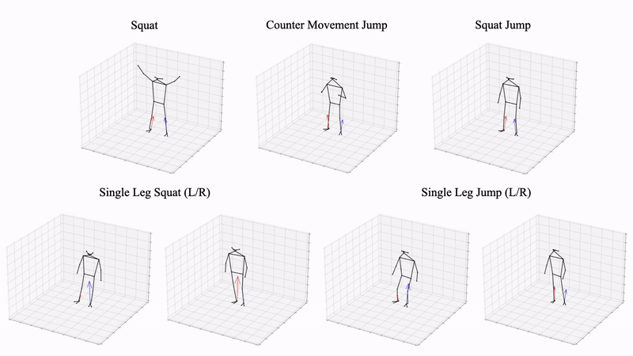

# ForcePose

This repo contains code and data for [*Learning to Estimate External Forces of Human Motion in Video, ACMMM 2022*](https://arxiv.org/pdf/2207.05845.pdf).


## Dataset
**Download data** [here](https://drive.google.com/file/d/16gE9JlcLt1QWJ3woDCYFLfOCduC2WOeL/view?usp=sharing)

Preparing data (from home directory):
Run `python3 prepare_data_force_pose.py`

This will create three files:
- data/data_2d_force_pose_pt_coco.npz
- data/data_3d_force_pose.npz
- data/data_2d_force_pose_gt.npz

ForcePose contains the following movements (shown as triangulated COCO detections below)


## Code

### System Requirements:
- Linux (Tested on Ubuntu 20.04)
- CUDA 11.x
- Python 3.8+
- PyTorch 1.7.1+

### Creating a Conda Virtual Environment:

```bash
conda env create -f environment.yml
conda activate forcepose
```

### Testing:
In our experiments, we optimize each modality for the lowest RMSE. Hence, the number of frames for pre-trained models will vary.

**Download saved weights**: [mocap](https://drive.google.com/file/d/1c0WV6XFJ7sX_8VGr1ZJa5yoawPMjeEiM/view?usp=sharing), [coco_3d](https://drive.google.com/file/d/1pMCVymxN7pZFruZdsCKHREK_zow-FHZ3/view?usp=sharing), [coco_2d](https://drive.google.com/file/d/1kf14T4UrqEO6zCVF6RSg1IEh0bh5-Crw/view?usp=sharing)
and extract inside of `checkpoints` directory.

| frames | num_force_thresh| input_type | data_path | checkpoint_name | 
|--|--|--|--|--|
|27|1|mocap|checkpoint/mocap|mocap_27frames.bin|
|27|2|mocap|checkpoint/mocap|mocap_27frames_t2.bin|
|43|1|3d|checkpoint/coco_3d|3d_43frames.bin|
|43|2|3d|checkpoint/coco_3d|3d_43frames_t2.bin|
|81|1|2d|checkpoint/coco_2d|2d_81frames.bin|
|81|2|2d|checkpoint/coco_2d|2d_81frames_t2.bin|

**Format:**
```
python3 run_poseformer_force.py \ 
	-k pt_coco \
	-b 512 \
	-f $frames \
	--checkpoint $data_path \
	--num_force_thresh $num_force_thresh \
	--evaluate $checkpoint_name \
	--dataset force_pose \
	-str Subject1,Subject2,Subject3,Subject4,Subject5,Subject6 \
	-ste Subject7,Subject8 \
	--input_pose_type $input_type
	--exp_name eval_test
```

**Example**:
```
python3 run_poseformer_force.py \ 
	-k pt_coco \
	-b 512 \
	-f 81 \
	--num_force_thresh 2 \
	--checkpoint checkpoint/coco_2d/ \
	--evaluate 2d_81frames_t2.bin \
	--dataset force_pose \
	-str  Subject1,Subject2,Subject3,Subject4,Subject5,Subject6 \
	-ste  Subject7,Subject8 \
	--input_pose_type 2d \
	--exp_name eval_test
```

### Training 
Remove the `evaluate` flag to train a new model or replace with `resume` or `pertained` to fine-tune an existing model.

## Acknowledgements
This code base was implemented from [VideoPose3D](https://github.com/facebookresearch/VideoPose3D) and [Poseformer](https://github.com/zczcwh/PoseFormer).
